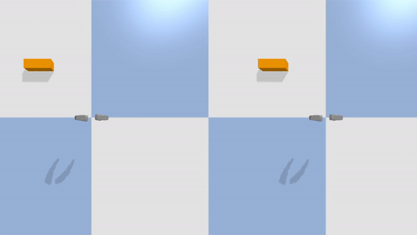
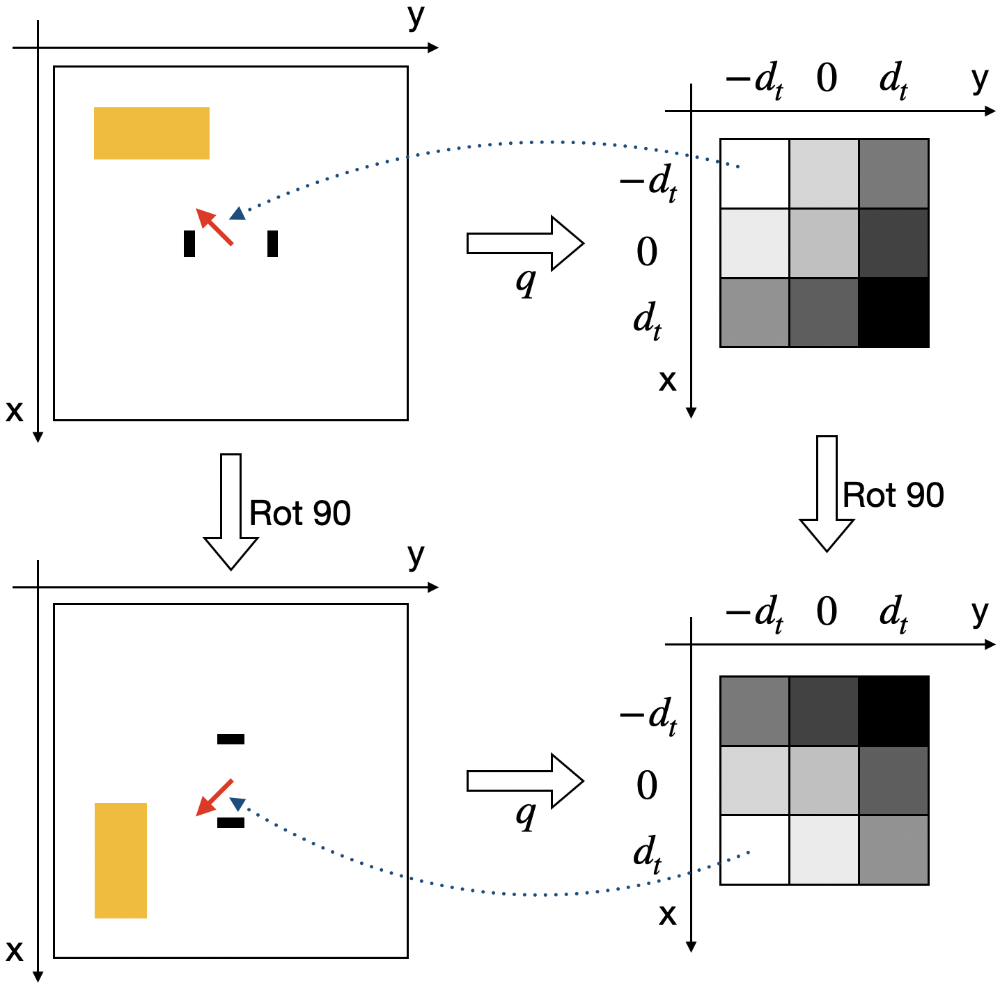
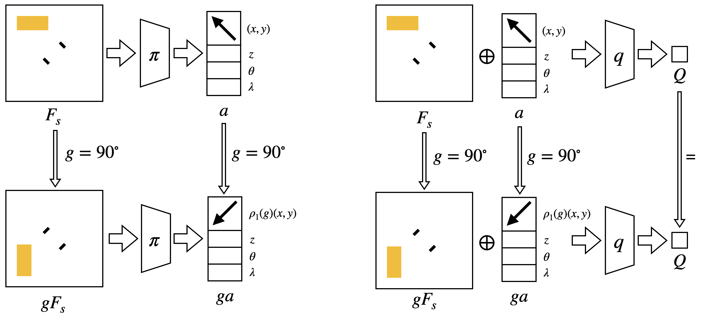
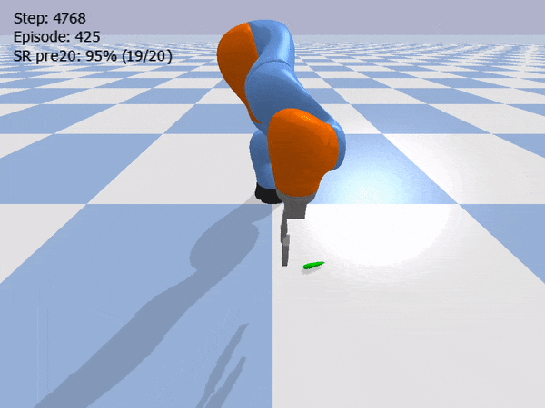
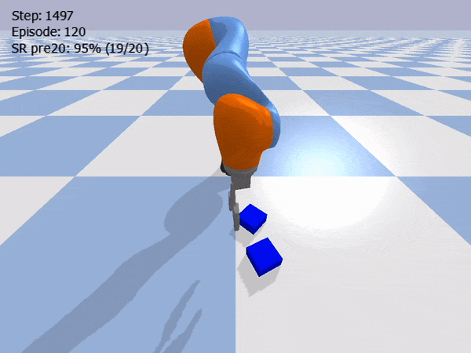
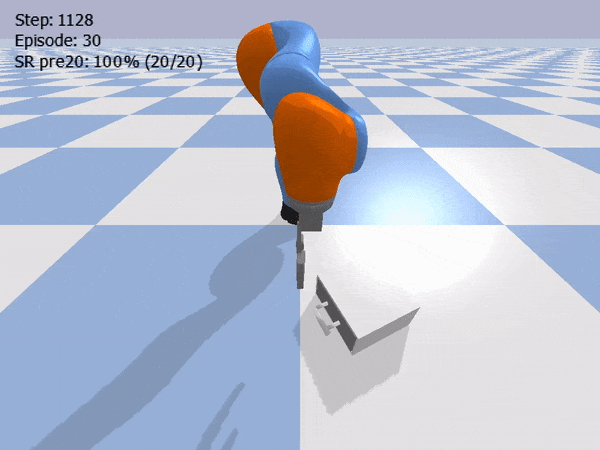
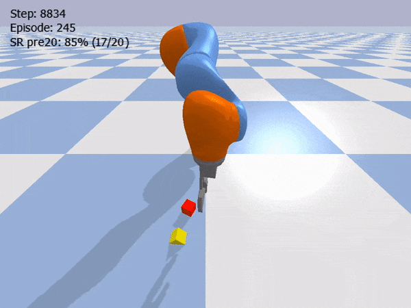
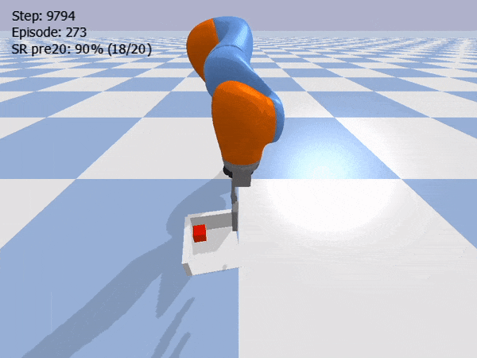

**Abstract:** Equivariant neural networks enforce symmetry within the structure of their convolutional layers, resulting in a substantial improvement in sample efficiency when learning an equivariant or invariant function. Such models are applicable to robotic manipulation learning which can often be formulated as a rotationally symmetric problem. This paper studies equivariant model architectures in the context of Q-learning and actor-critic reinforcement learning. We identify equivariant and invariant characteristics of the optimal Q-function and the optimal policy and propose equivariant DQN and SAC algorithms that leverage this structure. We present experiments that demonstrate that our equivariant versions of DQN and SAC can be significantly more sample efficient than competing algorithms on an important class of robotic manipulation problems.

<style>
.column {
  float: left;
  width: 33.33%;
}
.lc{
  float: left;
  width: 16.66%;
}
.caption {
    margin: 0;
    vertical-align: baseline;
    text-align: center;
}
img.rounded {
  object-fit: cover;
  border-radius: 50%;
  height: 100px;
  width: 100px;
  margin-left: auto;
  margin-right: auto;
  display: block;
}
.people_column {
  float: left;
  width: 150px;
}
</style>

## Paper
[OpenReview](https://openreview.net/forum?id=7F9cOhdvfk_)

<div>
  <div class="people_column">
    
    <p class="caption">
      <a href="https://pointw.github.io">Dian Wang</a>
    </p>
  </div>
  <div class="people_column">
    
    <p class="caption">
      <a href="https://pointw.github.io">Dian Wang</a>
    </p>
  </div>
  <div class="people_column">
    
    <p class="caption">
      <a href="https://pointw.github.io">Dian Wang</a>
    </p>
  </div>
</div>

[Dian Wang](https://pointw.github.io), 
[Robin Walters](http://mathserver.neu.edu/robin/), 
[Robert Platt](http://www.ccs.neu.edu/home/rplatt/)

Khoury College of Computer Sciences
Northeastern University


## Idea
<p align="center">
  
</p>

This work studies the equivariant property in robotic manipulation. We use equivariant networks to enforce the equivairance in the structure of the networks to improve the sample efficiency.

<p align="center">
  
</p>

In Equivariant DQN, if the input state of the Q-network is rotated, the output of the Q-network (where the value of each cell in the output 3x3 grid represents the Q-value of moving towards a specific direction) will be rotated by the same amount. 

<p align="center">
  
</p>

In Equivariant SAC, if the input state of the actor (left) is rotated, the output action of the actor will be rotated by the same amount. If the input state and action of the critic (right) are rotated, the output Q-value of the critic will remain the same.

<div>
  <div class="column">
    
    <p class="caption">Object Picking</p>
  </div>
  <div class="column">
    
    <p class="caption">Block Pulling</p>
  </div>
  <div class="column">
    
    <p class="caption">Drawer Opening</p>
  </div>
</div>

<div>
  <div class="column">
    
    <p class="caption">Block Stacking</p>
  </div>
  <div class="column">
    
    <p class="caption">House Building</p>
  </div>
  <div class="column">
    
    <p class="caption">Corner Picking</p>
  </div>
</div>

Our Equivariant SAC can solve different manipulation tasks with extraordinarily high sample effeciency.

## Video

## Code

[https://github.com/pointW/equi_rl](https://github.com/pointW/equi_rl)

## Citation
```
@inproceedings{
wang2022mathrmsoequivariant,
title={SO(2)-Equivariant Reinforcement Learning},
author={Dian Wang and Robin Walters and Robert Platt},
booktitle={International Conference on Learning Representations},
year={2022},
url={https://openreview.net/forum?id=7F9cOhdvfk_}
}
```

## Contact
If you have any questions, please feel free to contact [Dian Wang](https://pointw.github.io) at wang[dot]dian[at]northeastern[dot]edu.
